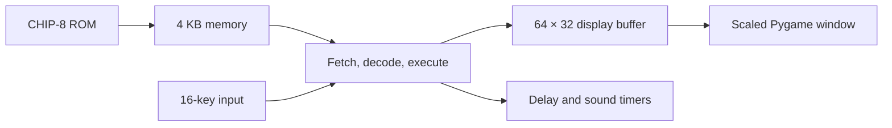

# CHIP-8 Emulator

<div align="center">


A from-scratch CHIP-8 emulator experiment with a 64×32 Pygame display, ROM loading, keypad input, timers, and opcode decoding.

</div>

## How it fits together



## Repository guide

- `p3.py` contains the most self-contained emulator loop and loads `random_number_test.ch8`.
- `chip8p2.py`, `cpu.py`, `emu.py`, `ppu.py`, `keyboard.py`, and `speaker.py` are the in-progress modular implementation.
- The `.ch8` files are ROMs used while developing and testing the emulator.
- `notes.md` and `notes.txt` capture implementation notes.

## Run it

```bash
python -m venv .venv
source .venv/bin/activate        # Windows: .venv\Scripts\activate
python -m pip install pygame
python p3.py
```

To try another ROM, change the path passed to `loadRom` in `p3.py`.

## Current scope

This is a learning project rather than a compatibility-complete emulator. Opcode coverage and behavior differ between the experimental implementations, and ROM compatibility is not guaranteed yet.

## Roadmap

- Accept the ROM path as a command-line argument.
- Consolidate the experimental CPU/PPU implementations.
- Complete opcode and quirk coverage.
- Add automated opcode tests and configurable key mappings.
